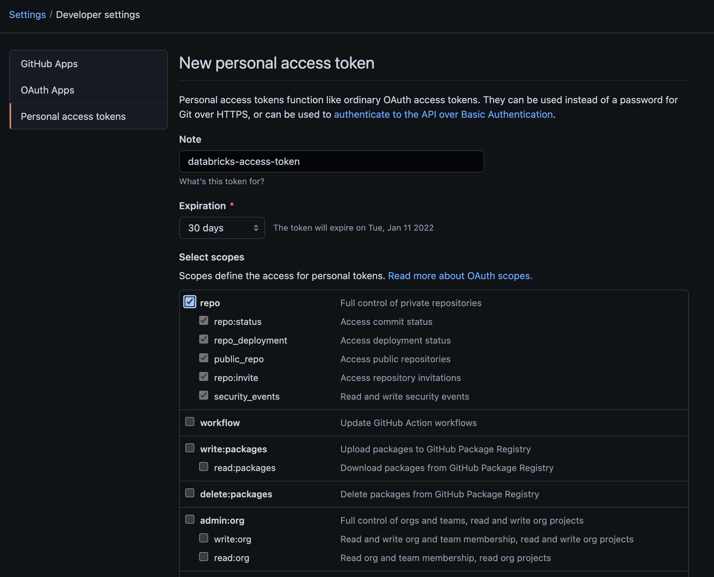
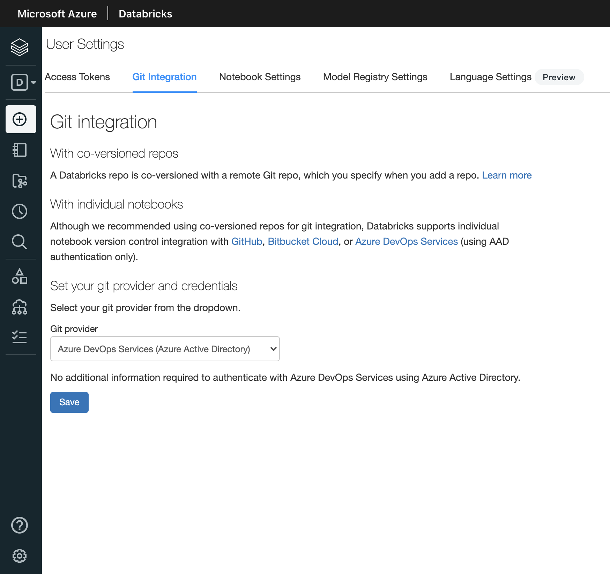
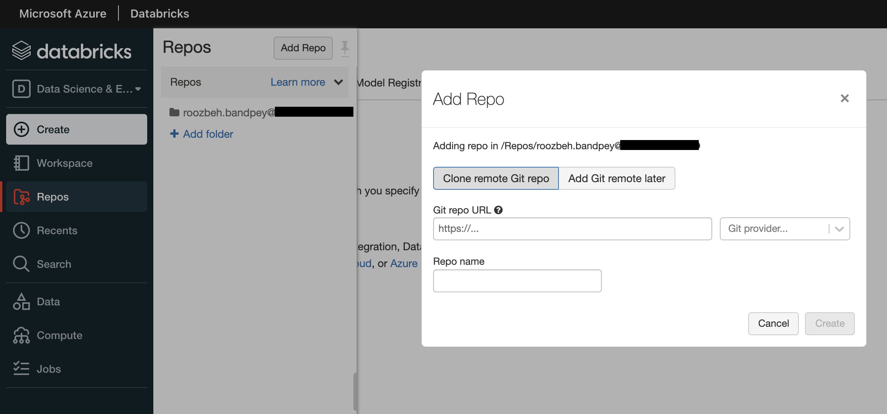
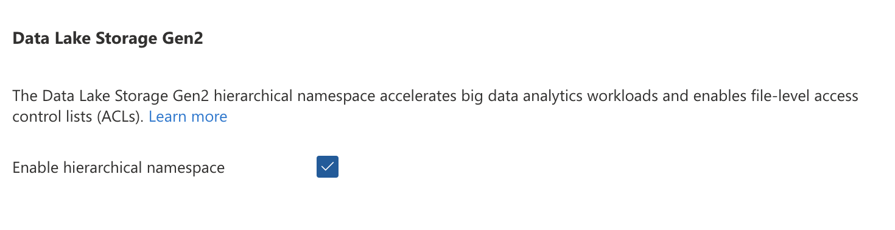
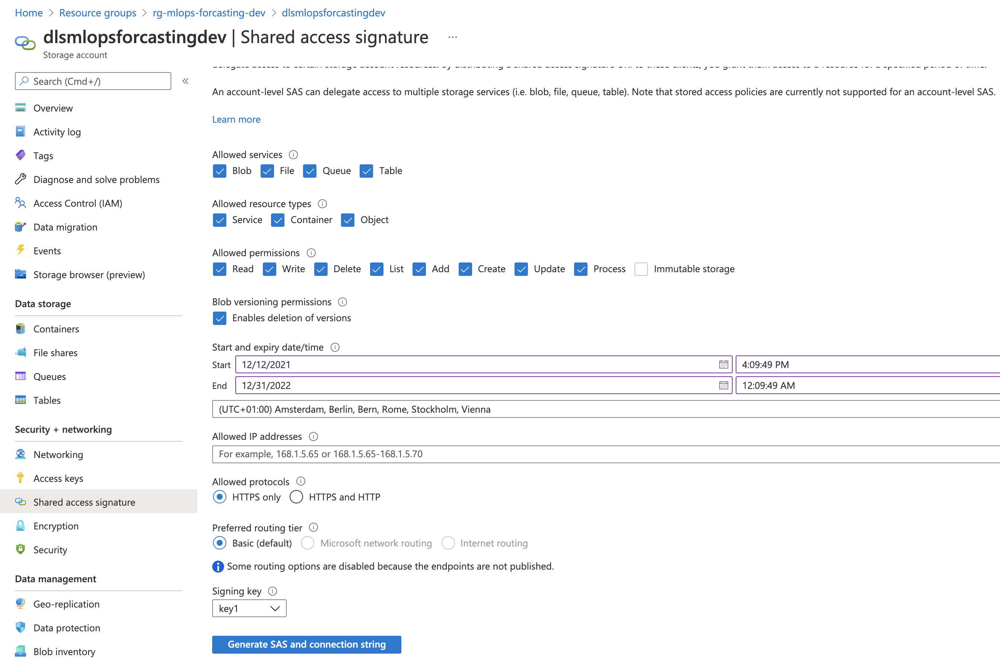
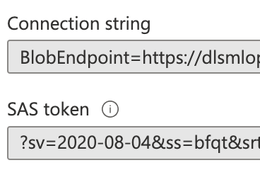
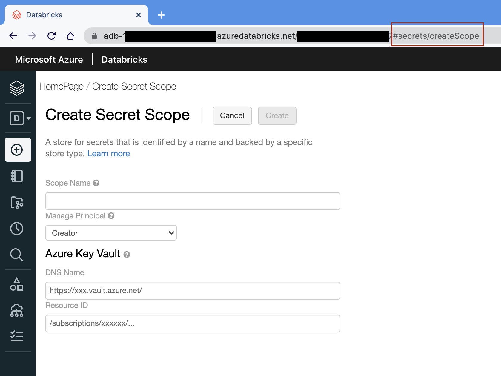

# Set up Databricks development environment

## Set up Databricks workspace
For the purpose of this demo we have provisioned a `Standard` Databricks workspace called `dbw-mlops-forecasting-dev` under the resource group `rg-mlops-forecasting-dev`

> Note that accessing data lake with standard Databricks is only possible through SAS keys, for credential pass-through you must use premium version

###  Setup repository access in Databricks workspace
For GitHub repos, head over to your GitHub settings, under Developer settings, click on Personal Access Token. The generate a new token given the name and expiration date. Following access rights are sufficient for Databricks (only full access to repo).



After that click on generate and copy the token, to be used in Databricks.

In your Databricks workspace click on settings, the select user settings, under the `Git Integration` Tab, select GitHub, enter your GitHub user name (email won't work, if you have multiple email setup), enter the GitHub personal access token and hit save.



Now Click on repos from Databricks sidebar, click on Add Repo, enter the url to your repository. Since we are connecting to an existing repository make sure the `Clone Remote Git Repo` is selected, enter your repository url and click create.



Congratulations! You have successfully connected your github repository to Databricks workspace. Now you can pull and push from the UI.
> Note that Databricks will only show you its onw files, so don't be surprised when you see other directories are empty.


## Set up Data Lake
For purpose of this demo we are using same storage account for Azure ML and Databricks. Although, while creating, Databricks will provision a dedicated storage account in its data plane (in managed resource group) we will create a storage account (ADLS Gen 2.0) to be mount to Databricks workspace as well as Azure ML workspace.


I have created an storage account called `dlsmlopsforecastingdev` under the resource group `rg-mlops-forecasting-dev`

Create a container with the name `bronze` and upload the files downloaded from [this Kaggle competition](https://www.kaggle.com/c/demand-forecasting-kernels-only/overview) under a folder called `kaggle-data`


> Note that for an storage account to be considered data lake the `Hierarchial namespace` must be enabled




### Generate a SAS token with all privileges
In the Storage View in the Azure Portal. Click "Shared access signature". Select all the permissions
Click "Generate SAS and connection string" to generate the SAS Token.



After token generation, copy and keep the `Connection String` and `SAS token` for later use in Keyvault.



## Set up Key Vault
Let's create a Key Vault called `kv-mlops-forecasting-dev` under resource group `rg-mlops-forecasting-dev`

### Create secrets for Storage access

Head over to secrets tap, click Generate/Import and create following secretes:

* `datalake-sas-token` enter SAS key as value
* `datalake-conn-str` enter confection string as value

### Access Azure Databricks Secrets UI

Now that you have an instance of Azure Key Vault up and running, it is time to let Azure Databricks know how to connect to it.

The first step is to open a new web browser tab and navigate to `https://&lt;your_azure_databricks_url&gt;#secrets/createScope` 

> The number after the `?o=` is the unique workspace identifier; append `#secrets/createScope` to this.



### Link Azure Databricks to Key Vault

Head over to key Vault, under properties, copy the `Vault URI` paste it under `DNS Name`. Copy `Resource ID` ad paste that as well, give the secret scope a name, for example `mlops-forecasting-secrets` select managed principle as `All Users`, the creator mode is only for premium edition. Finally hit create.

**List Secret Scopes**

To list the existing secret scopes the `dbutils.secrets` utility can be used.

```python
dbutils.secrets.listScopes()
```

**List Secrets within a specific scope**
```python
dbutils.secrets.list("scope_name")
```
**Using your Secrets**

To use your secrets, you supply the scope and key to the get method.
```python
print(dbutils.secrets.get(scope="students", key="storageread"))
```
Notice that the value when printed out is `[REDACTED]`. This is to prevent your secrets from being exposed.


**Mount Azure Blob Container - Read/List**

The code within [mount-storage.py](../demand-forecasting-dev/utils/mount-storage.py) will mount the storage to our workspace using SAS tokens. This means, any user within the workspace can view and read the files mounted using this key. This key can be used to mount any container within the storage account with these privileges.


## Purging Key Vault

```bash
az login
```

```bash
az account list
```

```bash
az account set --subscription 
```

```bash
az keyvault list-deleted [--resource-type]
                         [--subscription]
```


```bash
az keyvault purge [--hsm-name]
                  [--location]
                  [--name]
                  [--no-wait]
                  [--subscription]
```